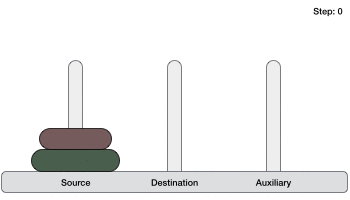

    
Tower of Hanoi puzzle with n disks can be solved in minimum 2n−1 steps. This presentation shows that a puzzle with 3 disks has taken 23 - 1 = 7 steps.

```
step 1 − Move n-1 disks from source to aux
Step 2 − Move nth disk from source to dest
Step 3 − Move n-1 disks from aux to dest
```
