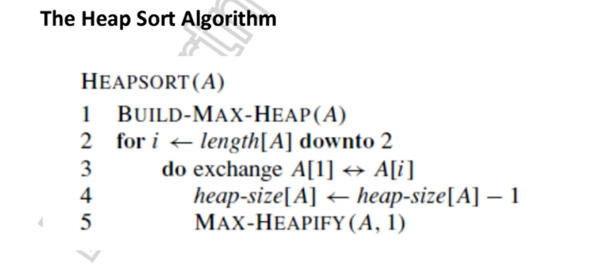
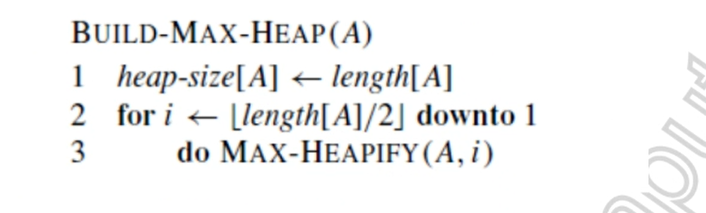
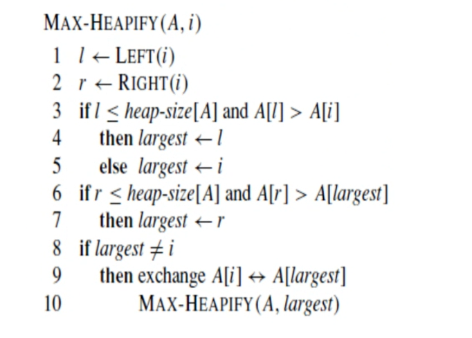

# HeapSort
- it's using the Binary Tree Data-Stucture [MAX/MIN HEAP]
- A max heap is a binary tree where every node has a value greater than or equal to its children and its vice-versa is called MIN Heap.  
- the children of a node at index i are located at indices 2i+1 and 2i+2.
- left children smaller than right children (in ref. of value)

  

## BUILD MAX-HEAP
- Complexity to build MAX-HEAP - O(n)

  

## MAX HEAPIFY
- Time Complexity : log n

- Pictorial Representation

## Time Complexity
 